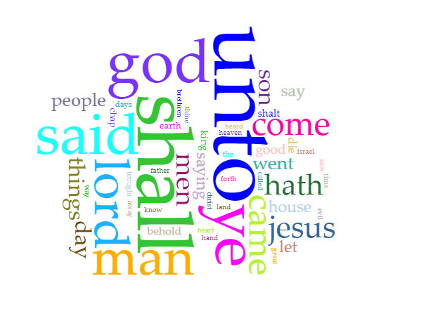
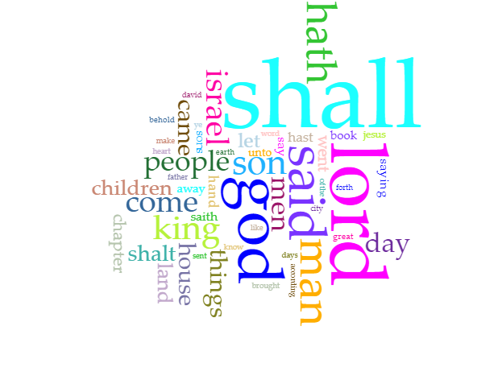
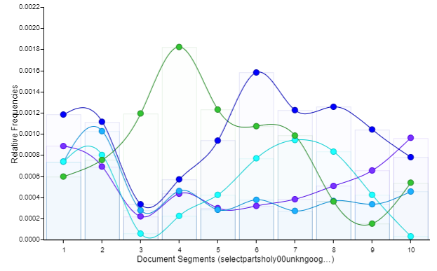

# Abstract
In this lab report, I be discussing the use of the slave bible, otherwise known as “Parts of the Holy Bible, selected for the use of the Negro Slaves, in the British West-India Islands” as a tool of oppression during the slave trade. I will also be comparing the contents of the slave bible with the holy bible in order to reveal the agenda of the story crafted by a group of people attempting to justify their wrong doings. One such idea interpreted to suit the narrative, was absolute obedience to a master was the will of God. 

# Introduction
The slave bible originally titled “Parts of the Holy Bible, selected for the use of the Negro Slaves, in the British West-India Islands” (Little 2019) published in 1807, was a tool used by slave owners to minimise the possibilities of the enslaved fighting back. This was done by filling the book, which slaves could not read due to language barriers, with messages glorifying submissive behaviour that were an exaggeration of stories interpreted from the Holy Bible.

The consensus around the use of the slave bible during the legal years of the practice, is that it was a tool of oppression. In a sense, this proves the old adage “knowledge is power” as those with the knowledge of the bibles chose to omit most of the Old Testament and parts of the new. This was thought to be done to reinforce the enslaved status on the people it applied to. The New Testament of the bible spoke a lot on love and peace, especially in loving “others as much as ‘one loves themselves’ ” (Summary of the Old & New Testament). This notion of love peace and understanding for fellow humans, was something not shown to slaves at the time. It was neither expected of them to show it in kind, as they were considered tools for farming and hard labour. 

From this point on, the “slave bible” will be referred to as the “book of enslavement” for clarification on how it is representative of the ideals of a select group of people forced on others as opposed to an actually religious text. Aided by Voyant, I will be diving into how the use of the book of enslavement during the trans Atlantic slave trade affected the relationship between the black population and settlers. This paper will also look at how white people of the past saw themselves at the top of the nonexistent hierarchy of humans based on race highlighted in the text.         

# Methodology
Considering the focus of my research is to understand how the language used in the book of enslavement became a tool of oppression for slave masters. Through my findings a point of reference to the eventual systematic differences (advantageous or otherwise), allocated to various peoples will be brought to light. As the book of enslavement, did more than just reinforce enslaved status, it perpetrated a mindset. 

To complete the journey of understanding, two questions had to be answered. Firstly, what parts of the holy bible were omitted when creating the book of enslavement. This is in reference to the old or new testaments as a whole, with examples of few specific chapters. Secondly, I pondered what the holy bible actually says about slaves and slavery. Answering this question will prove the creation of the book of enslavement, as a tool of oppression and confusion to those its teaching was forced on.  

In search of the answer to my first question, it was made clear that a large part of the old and new testaments were omitted for various reasons. One recurring reason is the fear of a revolution from the slaves, sparked by the Christian beliefs of equality amongst unrelated groups of people. The book of Galatians peddled such ideas, it spoke of love, acceptance, and sowing what one reaps. Understandably, if shown to people being treated like animals and forced to work against their wills, there would be an uprising of sorts either sooner or later. 

Any and all parts of the bible where “evil people” were punished for their deeds (like the book of revelations) was taken out in favour of text on obedience and submissive behaviour. Ephesians was one such chapter beloved by proponents of slavery, in which it calls for servants to be “obedient to them that are ‘their’ masters according to the flesh, with fear and trembling, in singleness of your heart, as unto Christ” (Ephesians 6:5).        
  
The outlook on slavery within the bible were more metaphorical than literal. “A slave to God”, “a slave having two masters (God and mammon)” and even “acting as a slave toward others” (The Bible and slavery) all allude to the comparison of the “relationship between God and humankind to that of a master and his slaves” (The Bible and slavery) as it was Jesus’s view on slavery within the bible. An example of this view can further be found in Matthew 20:20-28, where it was thought “necessary to be a slave to be "first" among the deceased entering heaven” (The Bible and slavery). 

Results:
The mistreating of a person, be them a slave or not, was frowned upon (for lack of better words) in the bible. Through research, it was revealed “slaves” in parts of the bible, was a reference to the relationship between God and humankind. In other parts, while more in line with the thinking of a servant, slaves were not a subclass of humans in anyway, but instead workers to a household still to be looked upon with dignity to some degree. 

Given that the optical character recognition software (OCR) produced text that while readable to some degree, was not without its errors, all results must be taken with some leeway. Random numbers and characters plague the text reducing its reliability and usefulness. That said, the poor data can still give context both on its own and when compared to other text like the bible.

Comparing the cirrus charts from both the holy bible and book of enslavement, it becomes apparent the agenda of each text through their wording. Upon closer inspection, while both snap shots form Voyant include similar words like “God”, “shall”, “men”, “people” and of course “Jesus” to name a few, their differences cannot be overlooked. 

With the previously stated objectives of the book of enslavement, the most used words (largest words in image), “ye”, “shall” and “unto” speak more of what one can do for another. With the inclusion of “house” and “land”, a setting of where servants are needed is created. This conclusion is further backed by the image below, which shows the use of words in order from most to least.

The words “God”, “Jesus” and any other variations of the two, appear less frequently than other words like “ye”. Granted this was a book crafted to push an ideal through story telling, the time period and use dictate the difference in language from the original bible and what we use now. That is, the popularity of words considered to be “old English” as well as the sentence structure is reason for some words, though they seem unimportant, to appear more than others.           

# Discussion
The book of enslavement in all its glory, was presented as an absolute declaration from God to his followers. In this specific case, the followers refer only to the blacks that were expected to be subservient to the whites. 

0
As seen in the trends Graph above, God through the text is used most at the end as opposed to being a consistent theme. 

It can be surmised through these results that “God” in this instance, refers to a white man of power rather than an omnipotent being. This idea creates a hierarchy that begins with the white man, then trickles down to the “others”. He or they are above all else, justifying why slaves were treated in such inhumane ways, based on the differences in physical appearance, language, and culture.

# Works Cited
“The Bible and Slavery.” Wikipedia, Wikimedia Foundation, 31 Mar. 2022, en.wikipedia.org/wiki/The_Bible_and_slavery. 
Little, Becky. “Why Bibles given to Slaves Omitted Most of The Old Testament.” History.com, A&E Television Networks, 11 Dec. 2018, www.history.com/news/slave-bible-redacted-old-testament#:~:text=The%20reason%3F,the%20British%20West-India%20Islands. 
“Summary of the Old & New Testament.” Summary of the Old and New Testament, www.questionsgod.com/summary-of-bible.htm. 

